</a> 

 

<h4><a href="http://www.shenyun.com">观看最新的〝神韵晚会〃，请到当地剧院买票观看，演出行程可以查询：http://www.shenyun.com</a></h4>
  
<TABLE border="1">

	
<TR>
<TD align="center"><b> <a href="https://git.io/goal"><h2>《九评》编辑部新书——《共产主义的终极目的——中国篇》</a></h2>
 
共产主义来自何处？为什么宇宙中会冒出个共产党？共产主义的本质究竟是什么？结局又会怎样？对这些根本问题的答案，人们众说纷纭，现在是揭开谜底的时候了。</b></td>
</TR>
<TR>
<TD>下载全书：<a href="https://github.com/pkey5/dj/blob/master/download/JPN-S-V2-171216.pdf?raw=true">PDF简体版</a>，<a href="https://github.com/pkey5/dj/blob/master/download/JPN-T-V2-171216.pdf?raw=true">PDF正体版，<a href="https://github.com/pkey5/dj/blob/master/download/JPN-S-V2-171216D.docx?raw=true">WORD简体版</a>，<a href="https://github.com/pkey5/dj/blob/master/download/JPN-T-V2-171216D.docx?raw=true">WORD正体版</a>，<a href="https://github.com/pkey5/dj/blob/master/download/Tekan_V24_P32_GB.pdf?raw=true">PDF高清杂志简体版</a>，<a href="https://github.com/pkey5/dj/blob/master/download/Tekan_V24_P32_TC.pdf?raw=true">PDF高清杂志正体版，<a href="https://github.com/pkey5/dj/blob/master/download/JPN-S-V2-171216D-2018-0326update.zip?raw=true">简体字TXT文本</a>，<a href="https://github.com/pkey5/dj/blob/master/download/JPN-T-V2-171216D-2018-0326.epub_.zip?raw=true">正体字TXT文本</a>  </TD>
</TR>
<TR>
<TD>下载：<a href="https://github.com/pkey5/dj/blob/master/download/gbUltiGoalCmChina.epub?raw=true">epub简体版电子书</a>，<a href="https://github.com/pkey5/dj/blob/master/download/twUltiGoalCmChina.epub?raw=true">epub正体版电子书，<a href="https://github.com/pkey5/dj/blob/master/download/goalmp3Npr.epub?raw=true"> (音频全书-实体镶崁) epub 下載，
	<a href="https://github.com/pkey5/dj/blob/master/download/goal8K.zip?raw=true">希望之声声音档(mp3)，<a href="https://github.com/pkey5/dj/blob/master/download/goalmp4Npf.epub?raw=true">视频(链接)播报版 epub 下载</a>，<a href="https://github.com/goodabc/GCC/blob/master/zjmd.md"> 12集(实体镶崁mp4播报版) epub 下載</a></TD>
</TR>
<TR>
<TD><a href="https://github.com/3fmd/gm/blob/master/epub.md"><b>手机、电脑打开 epub 电子书方法介绍。下载更多的免费(視頻、音頻、圖文) epub 电子书。</b></a></TD>	
</TR>

</TABLE>

<h1 align="center"><b>真相传单：三退与平安（第319期）</b></h1>
<table border="0" cellspacing="3" cellpadding="3">
<tbody>
<tr>
<td align="center">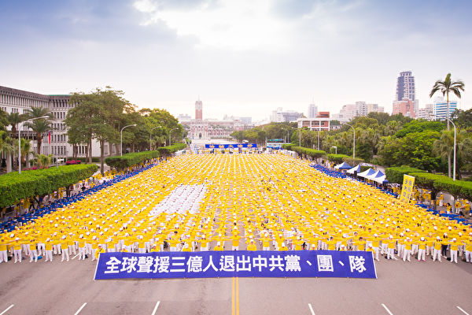</td>
</tr>
</tbody>
</table>

目录

台湾民众声援三亿中国人“三退” 
我为什么“三退” 
十九年前的“四•二五”万人和平大上访 

下载： 
<a href="https://github.com/jigshu/3t/blob/master/download/santui-316-pdf.pdf?raw=true">PDF压缩文件（992KB）</a> 
<a href="https://github.com/jigshu/3t/blob/master/download/santui-316-doc.doc?raw=true">WORD压缩文件（701KB）</a> 

（发稿日期： 2018年04月27日）

<h1 align="center"><b>真相传单：三退与平安（第318期）</b></h1>
<table border="0" cellspacing="3" cellpadding="3">
<tbody>
<tr>
<td align="center">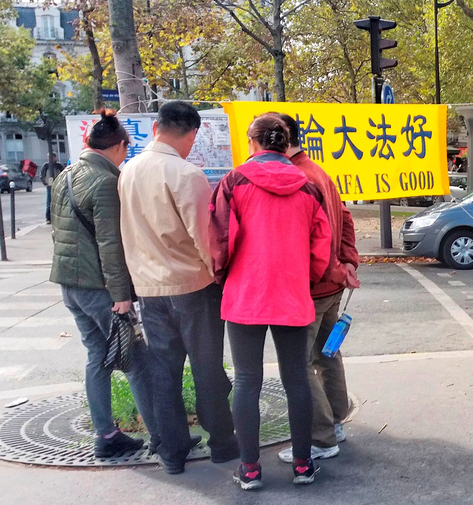</td>
</tr>
<tr>
<td align="center">图：大陆游客在巴黎艾菲尔铁塔真相点观看揭露中共迫害法轮功的展板。</td>
</tr>
	<tr>
<td align="center">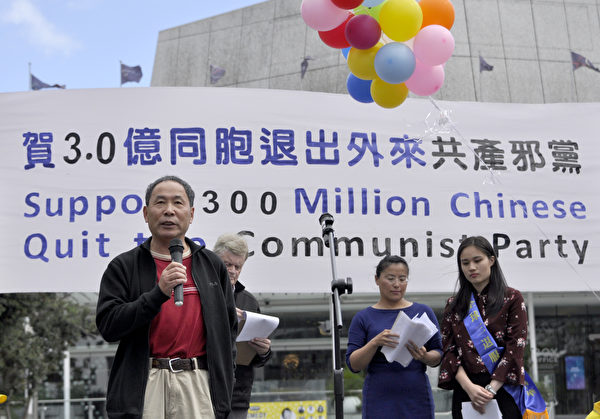</td>
</tr>
</tbody>
</table>

目录

大陆游客在法国巴黎集体“三退” 
庆三亿人“三退” 新西兰各界支持 
丹麦议会就中共迫害法轮功举行专题答辩会 
誓约与“三退” 

下载： 
<a href="https://github.com/jigshu/3t/blob/master/download/santui-316-pdf.pdf?raw=true">PDF压缩文件（695KB）</a> 
<a href="https://github.com/jigshu/3t/blob/master/download/santui-316-doc.doc?raw=true">WORD压缩文件（325KB）</a> 

（发稿日期： 2018年04月18日）

<h1 align="center"><b>真相传单：三退与平安（第317期）</b></h1>
<table border="0" cellspacing="3" cellpadding="3">
<tbody>
<tr>
<td align="center">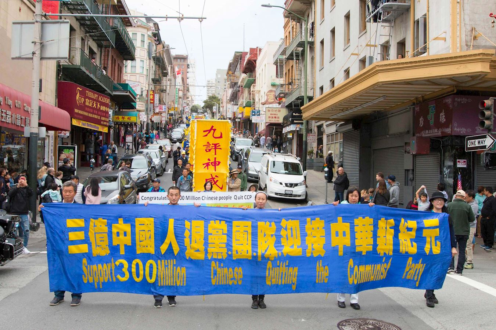</td>
</tr>
</tbody>
</table>

目录

美国旧金山游行声援三亿人三退 
曾经参与迫害的公安“三退” 并帮助法轮功学员 
美国乔治亚州参议院通过决议案 谴责中共活摘器官 
你发誓把生命献给幽灵了吗？ 

下载： 
<a href="https://github.com/jigshu/3t/blob/master/download/santui-316-pdf.pdf?raw=true">PDF压缩文件（928KB）</a> 
<a href="https://github.com/jigshu/3t/blob/master/download/santui-316-doc.doc?raw=true">WORD压缩文件（536KB）</a> 

（发稿日期： 2018年04月09日）

<h1 align="center"><b>真相传单：三退与平安（第316期）</b></h1>
<table border="0" cellspacing="3" cellpadding="3">
<tbody>
<tr>
<td align="center"></td>
</tr>
<tr>
<td align="center">图：三月十八日，香港法轮功学员举行游行活动声援近三亿人“三退”，吸引许多香港市民与大陆游客驻足观看。</td>
</tr>
</tbody>
</table>

目录

三亿中华儿女“三退” 预示着中共末日将要来临 
澳门法轮功学员声援三亿中国人“三退” 
主流社会精英们全部站起来说：同意（三退）！干杯！ 
抓紧时间 弃恶从善 快快“三退”神保平安 

下载： 
<a href="https://github.com/jigshu/3t/blob/master/download/santui-316-pdf.pdf?raw=true">PDF压缩文件（750KB）</a> 
<a href="https://github.com/jigshu/3t/blob/master/download/santui-316-doc.doc?raw=true">WORD压缩文件（369KB）</a> 

（发稿日期： 2018年03月28日）

<h1 align="center"><b>真相传单：三退与平安（第315期）</b></h1>
<table border="0" cellspacing="3" cellpadding="3">
<tbody>
<tr>
<td align="center">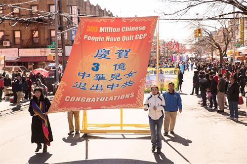</td>
</tr>
<tr>
<td align="center">2018年3月11日，近千名法轮功学员来到纽约第三大华人社区布碌伦第八大道举行盛大游行，传递“法轮大法好”、“天要灭中共 三退保平安”的天机。游行当日，有四十六人退出中共党团队，一百六十六人退出中共团队，三百四十九人退出中共少先队。</td>
</tr>
</tbody>
</table>

目录

“三退”人数接近三亿　民众感谢法轮功 
美国洛杉矶夏威夷花园市通过反强摘器官宣言 
“三退”才能有未来 

下载： 
<a href="https://github.com/jigshu/3t/blob/master/download/santui-315-pdf.pdf?raw=true">PDF压缩文件（712KB）</a> 
<a href="https://github.com/jigshu/3t/blob/master/download/santui-315-doc.doc?raw=true">WORD压缩文件（363KB）</a> 

（发稿日期： 2018年03月19日）

<h1 align="center"><b>真相传单：三退与平安（第313期）</b></h1>
<table border="0" cellspacing="3" cellpadding="3">
<tbody>
<tr>
<td align="center"></td>
</tr>
<tr>
<td align="center">图：法轮功学员设立的传播真相摊位，吸引了很多民众前来了解真相。</td>
</tr>
</tbody>
</table>

目录

迎新年集市　美国洛杉矶法轮功学员传播真相 
得知我赡养婆婆　当官的朋友们“三退”了 
我的父亲死而复生了 
三十六计 “退”为上策 

下载： 
<a href="https://github.com/jigshu/3t/blob/master/download/santui-313-pdf.pdf?raw=true">PDF压缩文件（631KB）</a> 
<a href="https://github.com/jigshu/3t/blob/master/download/santui-313-doc.doc?raw=true">WORD压缩文件（285KB）</a> 

（发稿日期： 2018年03月04日）

<h1 align="center"><b>真相传单：三退与平安（第312期）</b></h1>
<table border="0" cellspacing="3" cellpadding="3">
<tbody>
<tr>
<td align="center">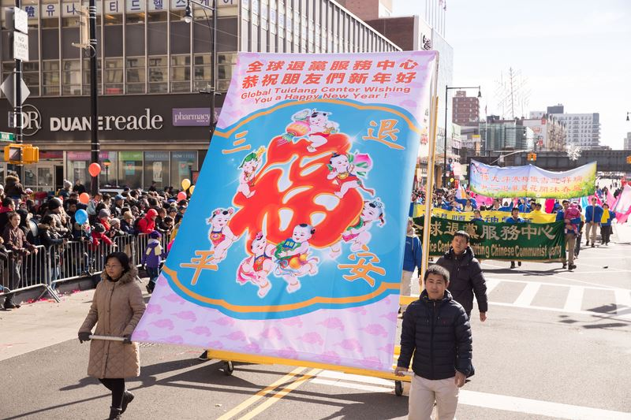</td>
</tr>
<tr>
<td align="center">图：“全球退党服务中心”参加纽约法拉盛中国新年戊戌年大游行，给民众拜年、送福。</td>
</tr>
</tbody>
</table>

目录

法拉盛戊戌年大游行　全球退党服务中心送真福 
我家亲友明白真相后“三退”得福报的故事 
原中共高官秘书：我比你知道的多，你给我退党吧 
“三退”才能在天灭中共的各种灾难中保平安 

下载： 
<a href="https://github.com/jigshu/3t/blob/master/download/santui-311-pdf.pdf?raw=true">PDF压缩文件（637KB）</a> 
<a href="https://github.com/jigshu/3t/blob/master/download/santui-312-doc.doc?raw=true">WORD压缩文件（340KB）</a> 

（发稿日期： 2018年02月24日）

<h1 align="center"><b>真相传单：三退与平安（第311期）</b></h1>
<table border="0" cellspacing="3" cellpadding="3">
<tbody>
<tr>
<td align="center">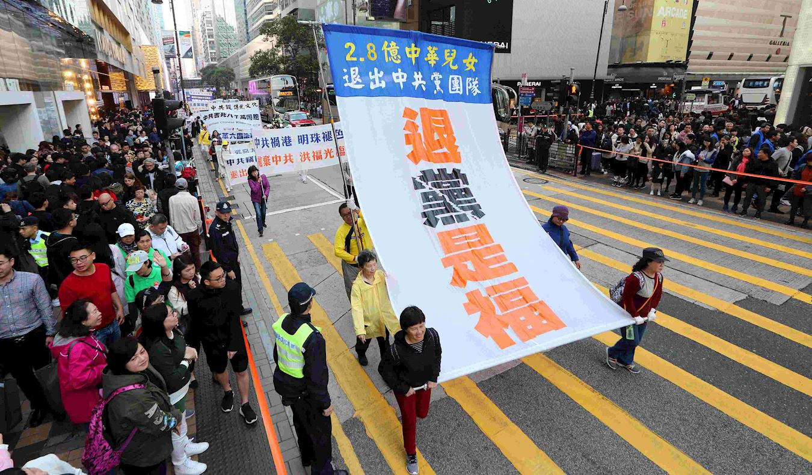</td>
</tr>
<tr>
<td align="center">2018年一月一日香港法轮功学员大游行</td>
</tr>
</tbody>
</table>
  
目录

新年新希望　“三退”保平安 
患骨髓癌的丈夫“三退”后康复了 
退休公安官员说：我坚决支持法轮功 并干脆利落地“三退” 
“三退”—— 不花一分钱的生命保险 

（下载：) 
<a href="https://github.com/jigshu/3t/blob/master/download/santui-311-pdf.pdf?raw=true">PDF压缩文件（894KB）</a> 
<a href="https://github.com/jigshu/3t/blob/master/download/santui-311-doc.doc?raw=true">WORD压缩文件（496KB）</a> 

（发稿日期： 2018年01月12日）

<h1 align="center"><b>真相传单：三退与平安（第310期）</b></h1>
<table border="0" cellspacing="3" cellpadding="3">
<tbody>
<tr>
<td align="center">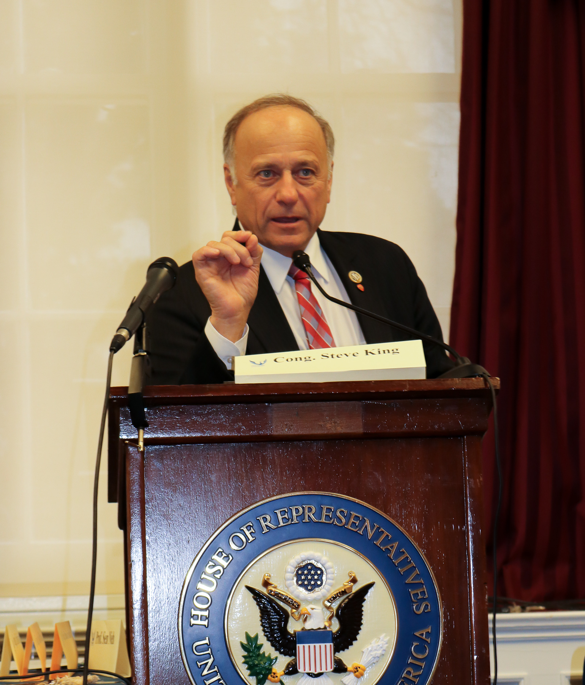</td>
</tr>
<tr>
<td align="center">美国共和党众议员史蒂夫·金（Steve King）说，法轮功学员只是想做好人，不应因此遭到中共迫害。</td>
</tr>
</tbody>
<table border="0" cellspacing="3" cellpadding="3">
<tbody>
<tr>
<td align="center"></td>
</tr>
<tr>
<td align="center">美国国会及行政当局中国委员会（CECC）主席——国会参议员马可·卢比奥（Marco Rubio，左）和众议员克里斯·史密斯（Chris Smith，右）致信声援法轮功学员。</td>
</tr>
</tbody>
</table>

目录

美国国会研讨会谴责中共迫害法轮功　关注“三退”潮 
诚念法轮大法好　骨瘤一夜之间不翼而飞 
书记：“我退（党），我用真名退（党）” 
只有声明“三退”废弃毒誓　才能拥有美好未来 

（下载：) 
<a href="https://github.com/jigshu/3t/blob/master/download/santui-310-pdf.pdf?raw=true">打印版：PDF压缩文件（499KB）</a> 
<a href="https://github.com/jigshu/3t/blob/master/download/santui-310-doc.doc?raw=true">编辑版/阅读版：WORD压缩文件（267KB）</a> 

（发稿日期： 2017年12月5日）

<h1 align="center"><b>真相传单：三退与平安（第309期）</b></h1>
<table border="0" cellspacing="3" cellpadding="3">
<tbody>
<tr>
<td align="center">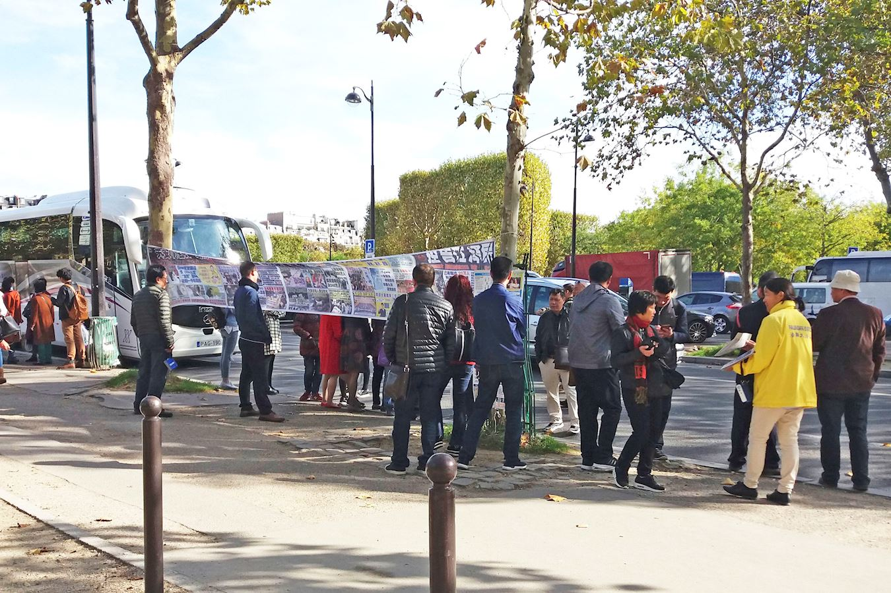</td>
</tr>
<tr>
<td align="center">法轮功学员将“中共迫害法轮功的真相”和”三退保平安”的内容印在横幅上，方便过往游客驻足观看。</td>
</tr>
</tbody>
</table>
  
目录

在巴黎的大陆游客：我们心里都知道法轮功好 
退休医生家属揭露中共强摘法轮功学员器官的邪恶 
国安部门的处长“三退”后想学法轮功 
“三退”是道德问题 

（下载：) 
<a href="https://github.com/jigshu/3t/blob/master/download/santui-309-pdf.pdf?raw=true">打印版：PDF压缩文件（710KB）</a> 
<a href="https://github.com/jigshu/3t/blob/master/download/santui-309-doc.doc?raw=true">编辑版/阅读版：WORD压缩文件（363KB）</a> 

（发稿日期： 2017年12月12日）

<h1 align="center"><b>真相传单：三退与平安（第308期）</b></h1>
<table border="0" cellspacing="3" cellpadding="3">
<tbody>
<tr>
<td align="center"></td>
</tr>
<tr>
<td align="center">图:2002年在贵州发现的“藏字石”断面上呈现“中国共产党亡”六个大字，昭示着“天灭中共”的天意。</td>
</tr>
</tbody>
</table>  
目录

两亿九千万民众抛弃中共　中共末日来临 
丹麦“医生日”　中共活摘法轮功学员器官罪行被关注 
单位领导全家“三退”得大福报 
为什么说“三退保平安” 

（下载：) 
<a href="https://github.com/jigshu/3t/blob/master/download/santui-308-pdf.pdf?raw=true">打印版：PDF压缩文件（555KB）</a> 
<a href="https://github.com/jigshu/3t/blob/master/download/santui-308-doc.doc?raw=true">编辑版/阅读版：WORD压缩文件（258KB） 

（发稿日期： 2017年11月27日）

<h1 align="center"><b>真相传单：三退与平安（第307期）</b></h1>
<table border="0" cellspacing="3" cellpadding="3">
<tbody>
<tr>
<td align="center">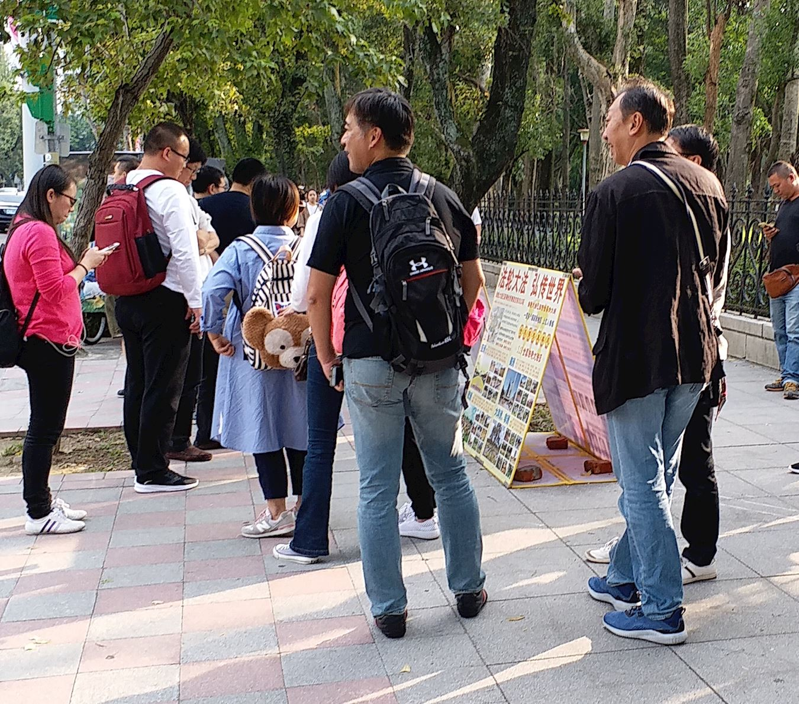</td>
</tr>  
<tr>  
<td align="center">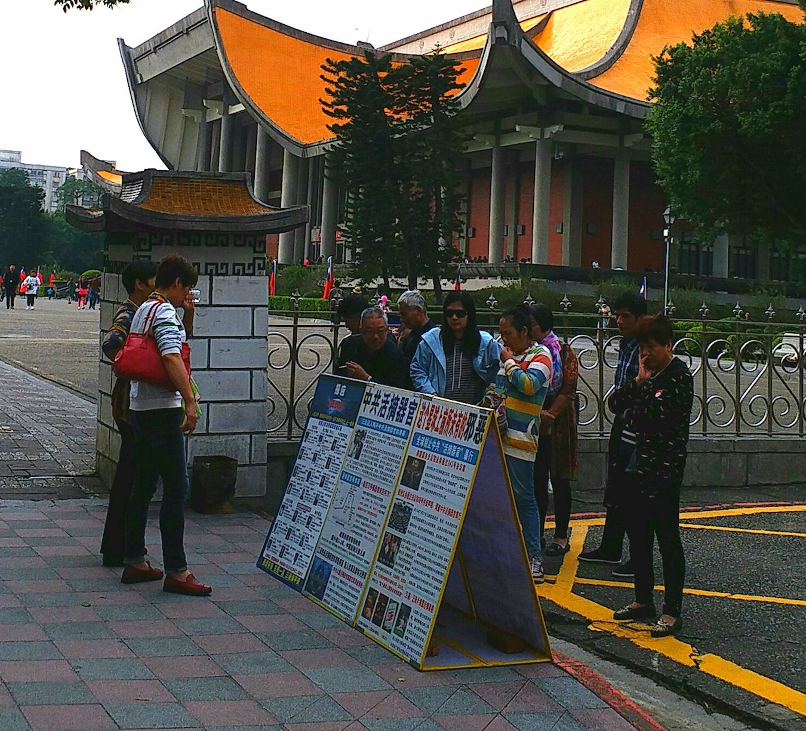</td>
</tr>
<tr>  
<td align="center"></td>
</tr>
<tr>  
<td align="center">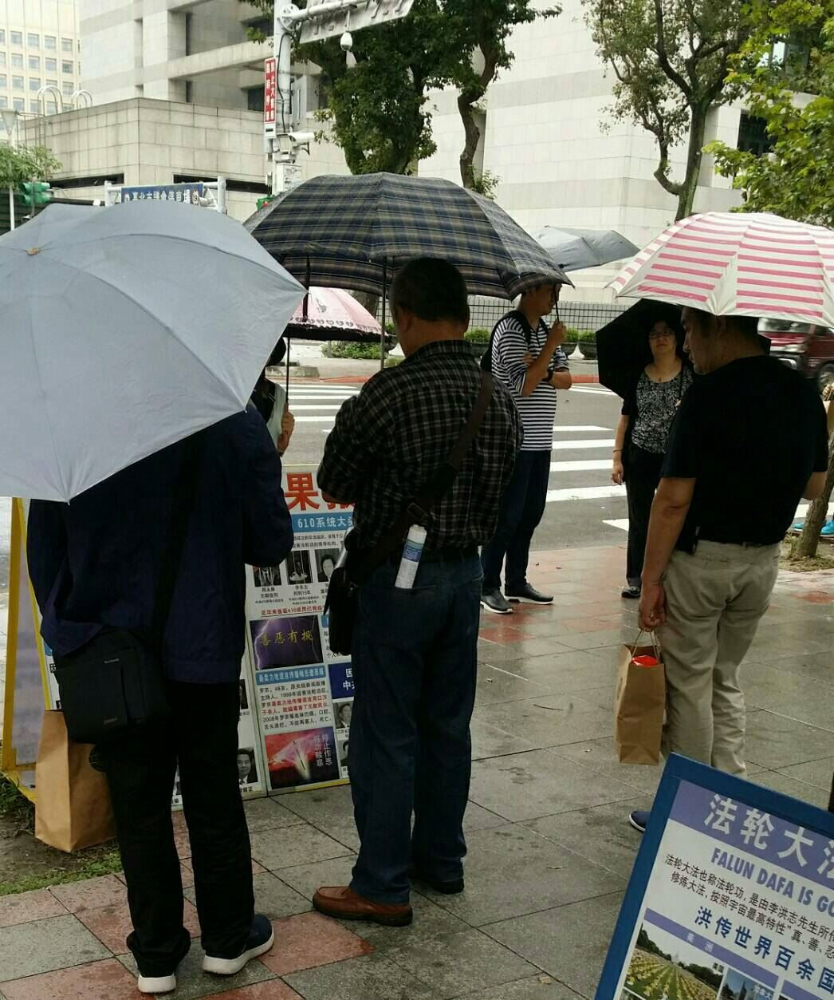</td>  
</tr>
<tr>
<td align="center">在台湾 “国父纪念馆”真相景点上，一批又一批的大陆游客驻足观看真相展板</td>
</tr>  
</tbody>
</table>

目录

台湾国父纪念馆前　大陆游客了解真相 
美国华盛顿大学举办《活摘》电影放映及讨论会 
退休师级军官“三退”后　对我敬了两次军礼 
看清中共的邪恶　不要再被欺骗 

（下载：) 
<a href="https://github.com/jigshu/3t/blob/master/download/santui-307-pdf.pdf?raw=true">打印版：PDF压缩文件（794KB）</a> 
<a href="https://github.com/jigshu/3t/blob/master/download/santui-307-doc.doc?raw=true">编辑版/阅读版：WORD压缩文件（512KB）</a> 

（发稿日期： 2017年11月22日）

<h1 align="center"><b>真相传单：三退与平安（第306期）</b></h1>
<table border="0" cellspacing="3" cellpadding="3">
<tbody>
<tr>
<td align="center"></td>
</tr>
<tr>
<td align="center">图：二零一七年十月七日，德国法轮功学员在著名旅游城市弗莱堡举办信息日，设立真相点，吸引各方民众驻足了解法轮功。</td>
</tr>
</tbody>
</table>
  
目录

德国名城弗莱堡信息日　各界民众了解法轮功 
肺癌晚期　“三退”后身体恢复健康 
狱中讲真相　有缘人“三退” 
“敲门行动”是违法犯罪 

（下载：) 
<a href="https://github.com/jigshu/3t/blob/master/download/santui-306-pdf.pdf?raw=true">打印版：PDF压缩文件（551KB）</a> 
<a href="https://github.com/jigshu/3t/blob/master/download/santui-306-doc.doc?raw=true">编辑版/阅读版：WORD压缩文件（273KB）</a> 

（发稿日期： 2017年10月21日）

<h1 align="center"><b>真相传单：三退与平安（第305期）</b></h1>
<table border="0" cellspacing="3" cellpadding="3">
<tbody>
<tr>
<td align="center">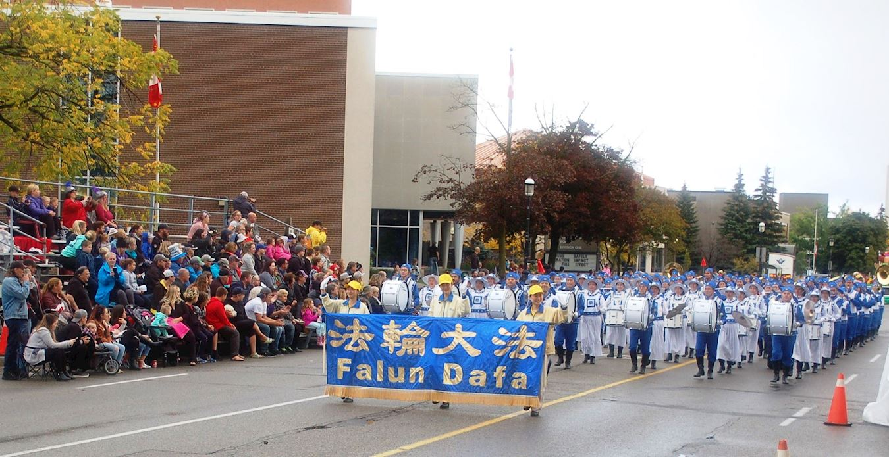</td>
</tr>
<tr>
<td align="center">图：二零一七年十月七日，德国法轮功学员在著名旅游城市弗莱堡举办信息日，设立真相点，吸引各方民众驻足了解法轮功。</td>
</tr>
</tbody>
</table>
  
目录

加拿大感恩节游行　观众赞法轮功辉煌 
法官和企业老板都“三退”了 
“敲门行动”让更多人看清了中共的邪恶 
身边同事得福报 

（下载：) 
<a href="https://github.com/jigshu/3t/blob/master/download/santui-305-pdf.pdf?raw=true">打印版：PDF压缩文件（732KB）</a> 
<a href="https://github.com/jigshu/3t/blob/master/download/santui-305-doc.doc?raw=true">编辑版/阅读版：WORD压缩文件（409KB）</a> 

（发稿日期： 2017年10月15日）

<h1 align="center"><b>真相传单：三退与平安（第304期）</b></h1>
<table border="0" cellspacing="3" cellpadding="3">
<tbody>
<tr>
<td align="center"></td>
</tr>
<tr>
<td align="center">呼吁停止迫害、制止中共活摘器官、法办元凶，以及明智选择退党保平安。</td>
</tr>
</tbody>
</table>
  
目录

香港法轮功学员集会游行反迫害　大陆游客震撼 
芬兰景点　中国游客“三退” 
听懂真相　“当官的”纷纷“三退”得福报 
打个比方讲道理 

（下载：) 
<a href="https://github.com/jigshu/3t/blob/master/download/santui-304-pdf.pdf?raw=true">打印版：PDF压缩文件（745KB）</a> 
<a href="https://github.com/jigshu/3t/blob/master/download/santui-304-doc.doc?raw=true">编辑版/阅读版：WORD压缩文件（397KB）</a> 

（发稿日期： 2017年10月09日）

<h1 align="center"><b>真相传单：三退与平安（第303期）</b></h1>
<table border="0" cellspacing="3" cellpadding="3">
<tbody>
<tr>
<td align="center">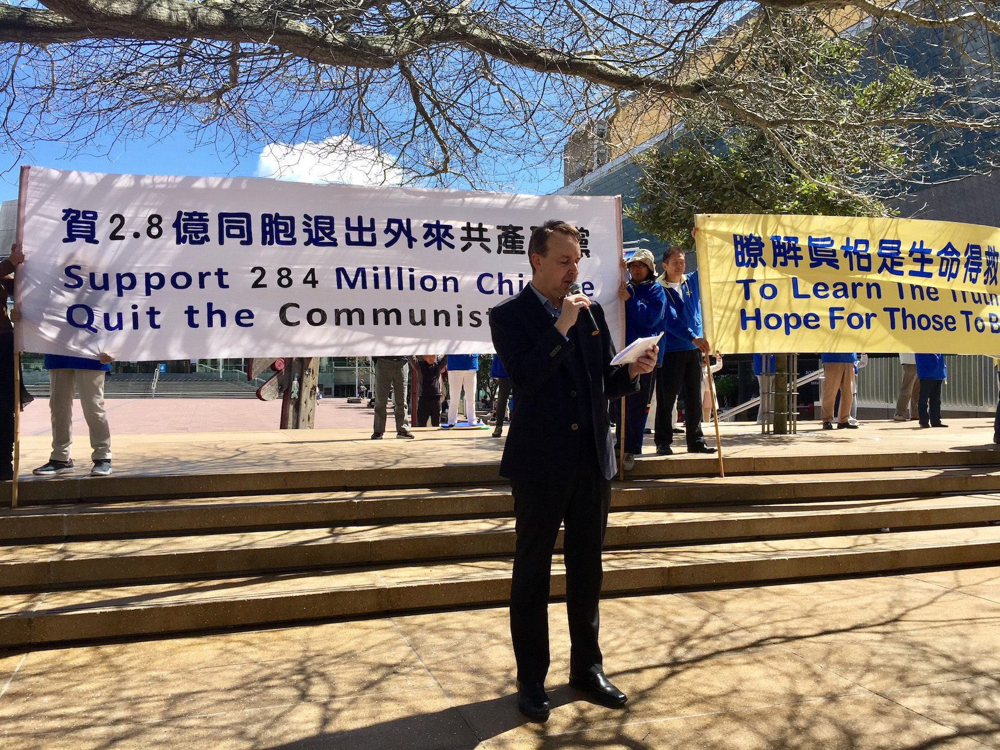</td>
</tr>
<tr>
<td align="center">人权律师Kerry Gore在演讲中</td>
</tr>
</tbody>
</table>
  
目录

新西兰庆祝两亿八千万中国人“三退” 
政府官员：快用真名帮我退出中共邪党吧！ 
结束迫害刻不容缓 
癌症晚期的二哥三个月痊愈 

（下载：) 
<a href="https://github.com/jigshu/3t/blob/master/download/santui-303-pdf.pdf?raw=true">打印版：PDF压缩文件（979KB）</a> 
<a href="https://github.com/jigshu/3t/blob/master/download/santui-303-doc.doc?raw=true">编辑版/阅读版：WORD压缩文件（686KB）</a> 

（发稿日期： 2017年10月02日）

<h1 align="center"><b>真相传单：三退与平安（第302期）</b></h1>
<table border="0" cellspacing="3" cellpadding="3">
<tbody>
<tr>
<td align="center">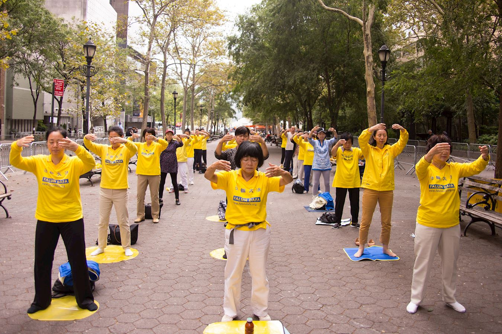</td>
</tr>
<tr>
<td align="center">2017年9月19日，纽约联合国大会期间，纽约法轮功学员在联合国附近和平请愿，要求中共停止迫害法轮功，法办江泽民。</td>
</tr>
</tbody>
</table>
  
目录

联合国大会期间　法轮功学员呼吁制止迫害 
“你们法轮功说的活摘（器官）是真的呀！” 
女士“三退”后说：“我很佩服法轮功，法轮功很坚强” 
2.8亿中国人为啥“三退” 

（下载：) 
<a href="https://github.com/jigshu/3t/blob/master/download/santui-302-pdf.pdf?raw=true">打印版：PDF压缩文件（727KB）</a> 
<a href="https://github.com/jigshu/3t/blob/master/download/santui-302-doc.doc?raw=true">编辑版/阅读版：WORD压缩文件（368KB）</a> 

（发稿日期： 2017年09月26日）

<h1 align="center"><b>真相传单：三退与平安（第301期）</b></h1>
<table border="0" cellspacing="3" cellpadding="3">
<tbody>
<tr>
<td align="center"></td>
</tr>
<tr>
<td align="center">澳洲法轮功学员连续在堪培拉国会大厦前的草地，举行集会</td>
</tr>
</tbody>
</table>
<table border="0" cellspacing="3" cellpadding="3">
<tbody>
<tr>
<td align="center">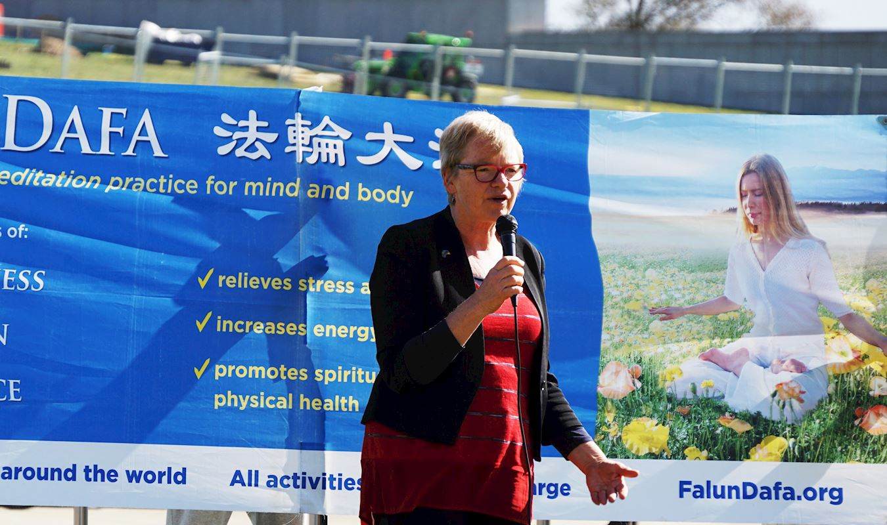</td>
</tr>
<tr>
<td align="center">澳洲绿党联邦参议员莱斯（Janet Rice）在集会现场演讲中</td>
</tr>
</tbody>
</table>  
目录

法轮功学员在堪培拉国会山集会　澳参议员到场支持 
重大车祸　女儿女婿平安无事 
原彭德怀的部下退党 
法轮功学员劝人“三退”是救人　不是搞政治 

（下载：) 
<a href="https://github.com/jigshu/3t/blob/master/download/santui-301-pdf.pdf?raw=true">打印版：PDF压缩文件（789KB）</a> 
<a href="https://github.com/jigshu/3t/blob/master/download/santui-301-doc.doc?raw=true">编辑版/阅读版：WORD压缩文件（423KB）</a> 

（发稿日期： 2017年09月20日）

<h1 align="center"><b>真相传单：三退与平安（第300期）</b></h1>
<table border="0" cellspacing="3" cellpadding="3">
<tbody>
<tr>
<td align="center"></td>
</tr>
<tr>
<td align="center">参议员安德森表示，迫害必须停止。</td>
</tr>
</tbody>
</table>
<table border="0" cellspacing="3" cellpadding="3">
<tbody>
<tr>
<td align="center">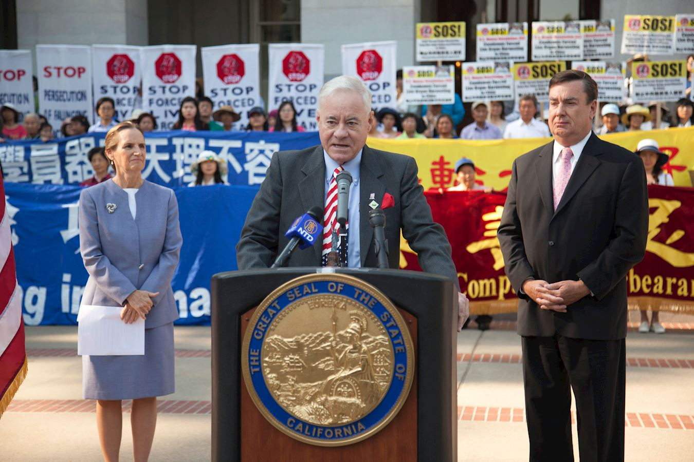</td>
</tr>
<tr>
<td align="center">众议员沃佩尔表示，法轮功学员代表了人类最美好的品德。</td>
</tr>
</tbody>
</table>  
目录

美国加州参议员：应站出来制止活摘器官 
司机大声连喊三遍：我退！我退！我退！ 
肝癌患者康复记 
“三退”——做个幸运之人 

（下载：) 
<a href="https://github.com/jigshu/3t/blob/master/download/santui-300-pdf.pdf?raw=true">打印版：PDF压缩文件（591KB）</a> 
<a href="https://github.com/jigshu/3t/blob/master/download/santui-300-doc.doc?raw=true">编辑版/阅读版：WORD压缩文件（340KB）</a> 

（发稿日期： 2017年09月20日）

