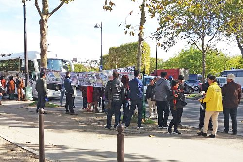
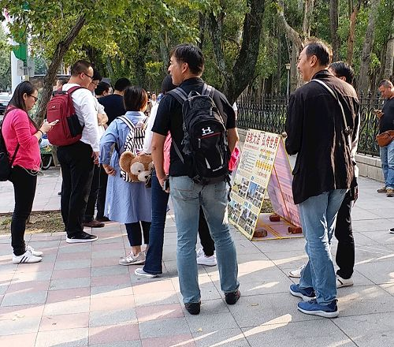
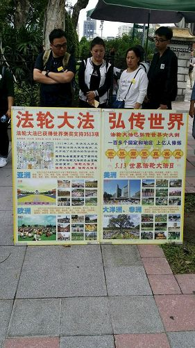
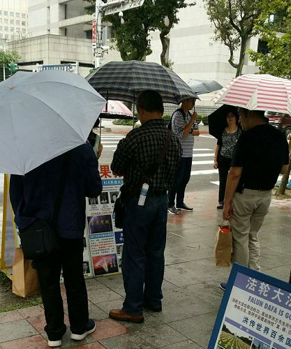
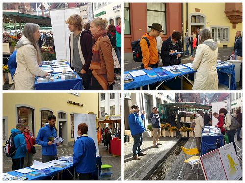

<h1 align="center"><b>真相传单：三退与平安（第309期）</b></h1>
<table border="0" cellspacing="3" cellpadding="3">
<tbody>
<tr>
<td align="center"></td>
</tr>
<tr>
<td align="center">法轮功学员将“中共迫害法轮功的真相”和”三退保平安”的内容印在横幅上，方便过往游客驻足观看。</td>
</tr>
</tbody>
</table>
  
目录

在巴黎的大陆游客：我们心里都知道法轮功好 
退休医生家属揭露中共强摘法轮功学员器官的邪恶 
国安部门的处长“三退”后想学法轮功 
“三退”是道德问题 

（下载：) 
<a href="https://github.com/jigshu/3t/blob/master/download/santui-309-pdf.pdf">打印版：PDF压缩文件（710KB）</a> 
<a href="https://github.com/jigshu/3t/blob/master/download/santui-309-doc.doc">编辑版/阅读版：WORD压缩文件（363KB）</a> 

（发稿日期： 2017年12月12日）

<h1 align="center"><b>真相传单：三退与平安（第308期）</b></h1>
  
目录

两亿九千万民众抛弃中共　中共末日来临 
丹麦“医生日”　中共活摘法轮功学员器官罪行被关注 
单位领导全家“三退”得大福报 
为什么说“三退保平安” 

（下载：) 
<a href="https://github.com/jigshu/3t/blob/master/download/santui-308-pdf.pdf">打印版：PDF压缩文件（555KB）</a> 
<a href="https://github.com/jigshu/3t/blob/master/download/santui-308-doc.doc">编辑版/阅读版：WORD压缩文件（258KB） 

（发稿日期： 2017年11月27日）

<h1 align="center"><b>真相传单：三退与平安（第307期）</b></h1>
<table border="0" cellspacing="3" cellpadding="3">
<tbody>
<tr>
<td align="center"></td>
</tr>  
<tr>  
<td align="center"></td>
</tr>
<tr>  
<td align="center"></td>
</tr>
<tr>  
<td align="center"></td>  
</tr>
<tr>
<td align="center">在台湾 “国父纪念馆”真相景点上，一批又一批的大陆游客驻足观看真相展板</td>
</tr>  
</tbody>
</table>

目录

台湾国父纪念馆前　大陆游客了解真相 
美国华盛顿大学举办《活摘》电影放映及讨论会 
退休师级军官“三退”后　对我敬了两次军礼 
看清中共的邪恶　不要再被欺骗 

（下载：) 
<a href="https://github.com/jigshu/3t/blob/master/download/santui-307-pdf.pdf">打印版：PDF压缩文件（794KB）</a> 
<a href="https://github.com/jigshu/3t/blob/master/download/santui-307-doc.doc">编辑版/阅读版：WORD压缩文件（512KB）</a> 

（发稿日期： 2017年11月22日）

<h1 align="center"><b>真相传单：三退与平安（第306期）</b></h1>
<table border="0" cellspacing="3" cellpadding="3">
<tbody>
<tr>
<td align="center"></td>
</tr>
<tr>
<td align="center">图：二零一七年十月七日，德国法轮功学员在著名旅游城市弗莱堡举办信息日，设立真相点，吸引各方民众驻足了解法轮功。</td>
</tr>
</tbody>
</table>
  
目录

德国名城弗莱堡信息日　各界民众了解法轮功 
肺癌晚期　“三退”后身体恢复健康 
狱中讲真相　有缘人“三退” 
“敲门行动”是违法犯罪 

（下载：) 
<a href="https://github.com/jigshu/3t/blob/master/download/santui-306-pdf.pdf">打印版：PDF压缩文件（551KB）</a> 
<a href="https://github.com/jigshu/3t/blob/master/download/santui-306-doc.doc">编辑版/阅读版：WORD压缩文件（273KB）</a> 

（发稿日期： 2017年10月21日）

<h1 align="center"><b>真相传单：三退与平安（第305期）</b></h1>
<table border="0" cellspacing="3" cellpadding="3">
<tbody>
<tr>
<td align="center"></td>
</tr>
<tr>
<td align="center">图：二零一七年十月七日，德国法轮功学员在著名旅游城市弗莱堡举办信息日，设立真相点，吸引各方民众驻足了解法轮功。</td>
</tr>
</tbody>
</table>
  
目录

加拿大感恩节游行　观众赞法轮功辉煌 
法官和企业老板都“三退”了 
“敲门行动”让更多人看清了中共的邪恶 
身边同事得福报 

（下载：) 
<a href="https://github.com/jigshu/3t/blob/master/download/santui-305-pdf.pdf">打印版：PDF压缩文件（732KB）</a> 
<a href="https://github.com/jigshu/3t/blob/master/download/santui-305-doc.doc">编辑版/阅读版：WORD压缩文件（409KB）</a> 

（发稿日期： 2017年10月15日）

<h1 align="center"><b>真相传单：三退与平安（第304期）</b></h1>
<table border="0" cellspacing="3" cellpadding="3">
<tbody>
<tr>
<td align="center"></td>
</tr>
<tr>
<td align="center">呼吁停止迫害、制止中共活摘器官、法办元凶，以及明智选择退党保平安。</td>
</tr>
</tbody>
</table>
  
目录

香港法轮功学员集会游行反迫害　大陆游客震撼 
芬兰景点　中国游客“三退” 
听懂真相　“当官的”纷纷“三退”得福报 
打个比方讲道理 

（下载：) 
<a href="https://github.com/jigshu/3t/blob/master/download/santui-304-pdf.pdf">打印版：PDF压缩文件（745KB）</a> 
<a href="https://github.com/jigshu/3t/blob/master/download/santui-304-doc.doc">编辑版/阅读版：WORD压缩文件（397KB）</a> 

（发稿日期： 2017年10月09日）

